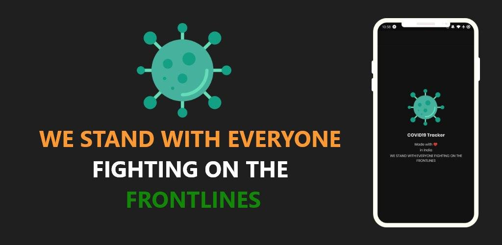

# India Covid19 Tracker

This is a Android App to track outbreak and transmission COVID19 in India.
The primary data source is collected by a crowdsourced database collated from various news as well as government sources.
 
 

## Development

- This project is forked from [Covid19 Tracker ReactNative](https://github.com/rbayuokt/Covid19-Tracker-ReactNative).